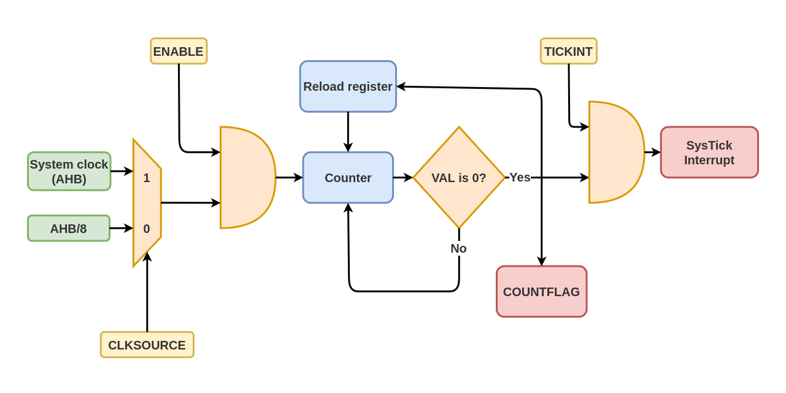

# STM32 Programming with libopencm3

 [](https://opensource.org/licenses/)\
Blinking an led on an STM32F1 Blue pill micro-controller with [libopencm3](https://github.com/libopencm3/libopencm3) is simpler than any alternative for professional developers.
The *Hello World* of embedded world, blinking led is super easy to implement by using a SysTick timer as a time base. The project is implemented using a library called libopencm3. In this medium blog post: [Programming STM32 Blue Pill using libopencm3](https://medium.com/@csrohit/stm32-blue-pill-using-libopencm3-882165a0d79f/), you will get to know about libopencm3 and how to use in our projects.

## libopencm3

The libopencm3 project aims to create an open-source firmware library for various ARM Cortex-M microcontrollers. The library supports most subsystems on *STM32F1* and other MCU series. It uses `gcc-arm-none-eabi` as the toolchain and `make` as the build system. Project-specific steps related to configuration and building are given in the sections below.\

To read more about the library visit [libopencm3 on GitHub](https://github.com/libopencm3/libopencm3).

## SysTick Timer

The processor has a 24-bit system timer, SysTick, that counts down from the reload value to zero, reloads, and counts down on the subsequent clocks.\
System Tick Time (SysTick) generates interrupt requests on regular basis. This allows an os to perform context switching to support multitasking. For applications that do not require an OS, the SysTick can be used for timekeeping, time measurement, or as an interrupt source for tasks that need to be executed regularly.\
The SysTick register can only be accessed using word access.

### Control flow



1. Program the reload value:\
   The reload value can be loaded by setting the `STK_RVR` (*Reload Value Register*) register. This value is set to 1 less than the number of clock cycles needed for the interrupt as the timer counts both reload value as well as zero. e.g. If the SysTick interrupt is required every 100 clock pulses, set `STK_CVR` to 99.\

   The following snippet consfigures SysTick for 1 ms interrupt.

   ```CPP
    systick_set_reload(rcc_ahb_frequency / 1000 - 1);
   ```

2. Clear current value:\
   This register can be accessed using the `STK_CVR` (*Current Value Register*) variable. Bits *24:31* are reserved and 24-bit value can be read from bits *23:0*. Writing any value this register sets it to zero along with setting `STK_CSR_COUNTFLAG` to zero.\
   The following API provided by libopencm3 achieves this tasks for the developer.

   ```CPP
    systick_clear();
   ```

3. Configure SysTick and start:
   1. Select clock source-\
        Clock source can be set using the `STK_CSR_CLKSOURCE` (*Clock source*) bit (2) of the `STK_CSR` (*Control and Status Register*) register.\
        0 - AHB/8\
        1 - Processor Clock (AHB)\
        libopencm3 has given us the following API for configuring the clock source for SysTick.

        ```CPP
        systick_set_clocksource(STK_CSR_CLKSOURCE_AHB);
        ```

   2. Enable Tick interrupt-\
        To enable the Tick interrupt set the `STK_CSR_TICKINT` bit (2) of the `STK_CSR` register.\ The following API is provided by libopencm3 for this task.

        ```CPP
        systick_interrupt_enable();
        ```

   3. Start SysTick timer-\
        SysTick timer can be started by calling the following API function.
        `STK_CSR_ENABLE` bit (0) of the `STK_CSR` register enables the counter. When `STK_CSR` is set to 1, the counter loads the `STK_RVR` value to the `STK_CVR` register and then counts down. On reaching 0, it sets the `STK_CSR_COUNTFLAG` to 1 and optionally asserts the `SysTick` depending on the value of `STK_CSR_TICKINT`. It then loads the `STK_RVR` value again and begins counting.\
        libopencm3 has provided the following API to enable SysTick timer.

        ```CPPs
        systick_counter_enable();
        ```

## Source code description

* *void rcc_periph_clock_enable(enum rcc_periph_clken clken)*: Enables the clock source for the peripherals.\
To enable the clock source for GPIO Port C, pass `RCC_GPIOC` value to `clken` input paramter of the API.[Click here](https://github.com/libopencm3/libopencm3/blob/7c09d0d14c99d5be56436a3864038212812bcd2a/lib/stm32/common/rcc_common_all.c#L134) to view function definition.

* *void systick_set_clocksource(uint8_t clocksource)*: Sets the clock source for SysTick timer.\
    The clock source can be either the AHB clock or the same clock divided by 8. The clock source is set to *AHB* by passing `STK_CSR_CLKSOURCE_AHB` to the `clocksource` value.
    [Click here](https://github.com/libopencm3/libopencm3/blob/7c09d0d14c99d5be56436a3864038212812bcd2a/lib/cm3/systick.c#L122).

* *void systick_clear(void)*: Clears SysTick current value register.\
SysTick counter value is cleared and the counter flag is reset.[Click here](https://github.com/libopencm3/libopencm3/blob/7c09d0d14c99d5be56436a3864038212812bcd2a/lib/cm3/systick.c#L187)to view function definition.

* *systick_set_reload(uint32_t value)*: Sets the automatic reload value for SysTick timer.\
The counter is set to the reload value when the counter starts and after it reaches zero. The SysTick counter value might be undefined upon the startup. To get the predictable behavior, it is a good idea to set or clear the counter after set reload. To set the timer to tick every millisecond, `rcc_ahb_frequency / 1000 - 1` value should be passed to the API. [Click here](https://github.com/libopencm3/libopencm3/blob/7c09d0d14c99d5be56436a3864038212812bcd2a/lib/cm3/systick.c#L56) to view function definition.

* *systick_interrupt_enable(void)*: Enables SysTick interrupt.\
 [Click here](https://github.com/libopencm3/libopencm3/blob/7c09d0d14c99d5be56436a3864038212812bcd2a/lib/cm3/systick.c#L132) to view function definition.

* *void systick_counter_enable(void)*: Enables SysTick counter.\
 [Click here](https://github.com/libopencm3/libopencm3/blob/7c09d0d14c99d5be56436a3864038212812bcd2a/lib/cm3/systick.c#L152) to view function definition.

* *gpio_set_mode(uint32_t gpioport, uint8_t mode, uint8_t cnf, uint16_t gpios)*: Set GPIO poin mode.\
Sets the mode (input/output) and configuration (analog/digital and open drain/push pull), for a set of GPIO pins on a GPIO port. In the code `gpioport` is `GPIOC`, `mode` is `GPIO_MODE_OUTPUT_2_MHZ` for setting the pin as output with speed as 2MHz, `cnf` as `GPIO_CNF_OUTPUT_PUSHPULL` for setting it as output in push-pull mode for `pin` `GPIO13` .\
 [Click here](https://github.com/libopencm3/libopencm3/blob/7c09d0d14c99d5be56436a3864038212812bcd2a/lib/stm32/f1/gpio.c#L93) to view function definition.

* *gpio_toggle(uint32_t gpioport, uint16_t gpios)*: Toggle a group of Pins.\
 The toggling is not atomic but but non-toggled pins are not affected. To toggle Pin13 of GPIO Port C, pass `GPIOC` as `gpioport` and `GPIO13` as `gpios`. [Click here](https://github.com/libopencm3/libopencm3/blob/7c09d0d14c99d5be56436a3864038212812bcd2a/lib/stm32/common/gpio_common_all.c#L87) to view function definition.

* *sys_tick_handler(void)*: Interrupt service routine for SysTick handler.\
 Increments the `ticks` variable.\
  [Click here](src/main.cpp#L44) to view function definition.

* *delay(uint32_t ms)*: Generates blocking delay.
    Executes `_NOP` instructions till `ms` milliseconds are over.\
    [Click here](src/main.cpp#L52) to view function definition.

## Project Working

This project configures the SysTick timer and uses it to generate a time-accurate delay for blinking an LED. The onboard LED connected to pin C13 blinks every second.

## Dependencies

* **make**\
    Make utility is required for configuring and building this project. You can install make on Linux by running the command:

    ```bash
    sudo apt install build-essential
    ```

* **gcc-arm-none-eabi toolchain**\
    ARM cross-platform toolchain is required to build applications for arm MCUs. The toolchain can be installed by running the following command:

    ```bash
    sudo apt install gcc-arm-none-eabi
    ```

* **openocd**\
    It is an Open On Circuit Debugging tool used to flash and debug arm microcontrollers. You can install openocd on Linux by running the command:

   ```bash
   sudo apt install openocd -y
   ```

* **Cortex Debug extension**\
    This extension for VSCode helps debug the application on Blue Pill. The contents of registers as well as memory are visible in the context menu.
    Launch VS Code Quick Open (Ctrl+P), paste the following command, and press enter.

     ```bash
    ext install marus25.cortex-debug
    ```

* **libopencm3**\
    After cloning this repository, clone the libopencm3 submodule and build for the required microcontrollers.

   ```bash
   git submodule update --init
   pushd libopencm3
   make TARGETS="stm32/f1"
   popd
   ```

## Project Structure

* `src` directory contains all source files for the project
* `include` directory contains all header files for the project
* `libopencm3` directory contains source and header files for the library

### Source file description

* `stm32f1.ld`  - linker script specific to the blue pill board
* `src\main.cpp` - application code body
* `STM32F103.svd` - contains the description of the system contained in Arm Cortex-M processor-based microcontrollers, in particular, the memory-mapped registers of peripherals.
* `Makefile` - main root level makefile for the project, which builds the binary

## Run Locally

Running the project is super easy. Just clone, build and flash.

### Clone the project

1. Using HTTPS

    ```bash
    git clone https://github.com/csrohit/bluepill-systick.git
    cd bluepill-systick/opencm3
    git submodule update --init
    ```

2. Using ssh

    ```bash
    git clone git@github.com:csrohit/bluepill-systick.git
    cd bluepill-systick/opencm3
    git submodule update --init
    ```

## Configuration

All the configuration required for building this project is given below.

1. Build output directory
    In `Makefile`, the output directory can be configured using the variable `BUILD_DIR`.

2. Build type
    In `Makefile`, the build type can be configured using the variable`BUILD_TYPE`. Possible values are `Debug` and `Release`.

3. Binary name
    In `Makefile`, the output directory can be configured using the variable `TARGET`.
    ** update the above info in `.vscode/launch.json` as well for debugging to work.

## Build

* Before building the project, remember to build the libopencm3 library for the specific micro-controller, without it project build will fail.

```bash
pushd libopencm3
make TARGETS="stm32/f1"
popd
```

* Run the following command in the terminal to generate flashable binaries for the blue pill board. Build files will be written to **Build Output Directory** as configured.

```bash
make all
```

## Flash

1. Connect ST-Link to PC and blue pill board using SWD headers.
2. Put the blue pill board in programming mode.
3. Run the following to flash the board with binary.

```bash
make flash
```

## Output

The Onboard led connected to Pin C13 can be observed to be blinking every second.

## Debug

Click on the `Run and Debug` option in the VsCode sidebar. Then launch the `Cortex Debug` target.

Happy debugging...
